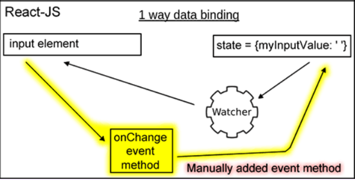
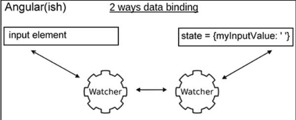

- 單向綁定與雙向綁定 #react/terminology/data-binding
  collapsed:: true
	- React 採用單向綁定 Modal 更新 => View 更新
	- 透過 Event 事件模擬雙向綁定(偽) 如下圖
	- 
	- 以 AngularJS 為例雙向綁定是 Modal 更新 => View 更新、 View 更新 => Modal 更新
	- 不需要再附加其他事件，由 AngularJS 觀察者自動通知更新
	- 
- 受控元件與不受控元件 #react/terminology/controlled&uncontrolled
  collapsed:: true
	- 值與變更的函式都是 props 傳遞做控制為受控制元件，反之則不受控制元件
	- ```jsx
	  import React, { useState } from 'react';
	  
	  import ExpenseItem from './ExpenseItem';
	  import Card from '../UI/Card';
	  import ExpensesFilter from './ExpensesFilter';
	  import './Expenses.css';
	  
	  const Expenses = (props) => {
	    const [filteredYear, setFilteredYear] =
	      useState('2020');
	  
	    const filterChangeHandler = (selectedYear) => {
	      setFilteredYear(selectedYear);
	    };
	  
	    return (
	      <div>
	        <Card className='expenses'>
	          <ExpensesFilter
	            selected={filteredYear}
	            onChangeFilter={filterChangeHandler}
	          />
	        </Card>
	      </div>
	    );
	  };
	  
	  export default Expenses;
	  ```
	- ```jsx
	  import React from 'react';
	  import './ExpensesFilter.css';
	  
	  const ExpensesFilter = (props) => {
	    const dropdownChangeHandler = (event) => {
	      props.onChangeFilter(event.target.value);
	    };
	  
	    return (
	      <div className='expenses-filter'>
	        <div className='expenses-filter__control'>
	          <label>Filter by year</label>
	          <select
	            value={props.selected}
	            onChange={dropdownChangeHandler}
	          >
	            <option value='2022'>2022</option>
	            <option value='2021'>2021</option>
	            <option value='2020'>2020</option>
	            <option value='2019'>2019</option>
	          </select>
	        </div>
	      </div>
	    );
	  };
	  
	  export default ExpensesFilter;
	  ```
- 有狀態元件與無狀態元件 #react/terminology/stateless&stateful
  collapsed:: true
	- 沒有內部狀態，只接收 props 數據顯示為無狀態元件，反之則是有狀態元件
	- ```jsx
	  import ExpenseDate from './ExpenseDate';
	  import Card from '../UI/Card';
	  import './ExpenseItem.css';
	  
	  const ExpenseItem = (props) => {
	    return (
	      <Card className='expense-item'>
	        <ExpenseDate date={props.date} />
	        <div className='expense-item__description'>
	          <h2>{props.title}</h2>
	          <div className='expense-item__price'>
	            ${props.amount}
	          </div>
	        </div>
	      </Card>
	    );
	  };
	  
	  export default ExpenseItem;
	  ```
- CSS module #react/ui/css
  collapsed:: true
	- ```jsx
	  // 新增 style.module.css
	  import styles from './style.module.css'
	  // 物件方式使用
	  <div className={styles["expense-item"]}>
	  ```
	-
- 使用 Portals 渲染指定的 DOM 節點#react/ui/portal
  collapsed:: true
	- 簡介
		- Portal 提供方法來讓 children 可以 render 到 parent component DOM 樹以外的 DOM 節點。
	- 使用案例
		- 當 parent component 有 overflow: hidden 或者 z-index 的樣式時，卻仍需要 child 在視覺上「跳出」其容器的狀況。例如 dialog、hovercard 與 tooltip 都屬於此案例。
	- ```jsx
	  ReactDOM.createPortal(child, container);
	  ```
	- > [如果是無障礙網頁的話要注意 Focus 焦點](https://zh-hant.reactjs.org/docs/accessibility.html#programmatically-managing-focus)
- 常見問題 #frontend-developer/interview/general
	- 你昨天或這週學習了什麼？
		- > Typescript
	- 寫程式的哪部份最讓你感到很興奮或是有興趣？
		- > 用頭腦解決問題並做出有意義的產品讓我感興趣
	- 最近有無遇過不容易的技術性問題，又如何解決？
		- > 懂得分析問題逐步拆解，例如需求是可以讓使用者簽名的 APP。從過往的經驗開始分析會需要 canvas 畫布技能、 固定螢幕 (overflow: hidden ) 讓使用者移動手指進行簽名，完成後需要擷取畫面轉成圖像供它人觀看確定已簽名，或者它需要呈現在某個 PDF 上進行簽名後與 PDF 合併。將可能出現的技能點會逐步列事項出來，再往下拆解查看自己是否有技術性的問題。如果沒有就皆大歡喜，有的話就往外找尋解決方案 (Google 或請教他人)
	- 當你開發一個新網站或維護一個網站時，你用過哪些技術來增進效能
		- > purecss 再壓縮未使用的 css 讓樣式更快的載入
	- 你能描述最近使用過的一些 SEO 最佳實作方法或技術嗎？
		- > 無
	- 你能解釋有關前端安全性的任何常見技術或最近解決的問題嗎?
		- > 需要防範 XSS 跨站腳本攻擊，當提供使用者輸入文本時需驗證是否有含程式碼。
		  > [前端安全—常见的攻击方式及防御方法 - 掘金 (juejin.cn)](https://juejin.cn/post/6981348663298064397)
	- 你個人在最近的專案採取過什麼行動來提升代碼的可維護性？
		- > Eslint 保持代碼風格，一定程度上可增加維護性
	- 說說你喜好的開發環境 (作業系統, 編輯器或 IDE, 瀏覽器, 開發工具 … 之類)
		- > VSCode
	- 你最熟悉哪一套版本控制系統？
		- > Git
	- 你可以描述你在開發一個網站時的工作流程嗎？
		- > 撇除前期需求訪談、藍圖發想後當進行討論功能與時程時，就需要評估自己的是否有技術性問題，有做過的可以當下評估，沒做過的但知道大概架構的需要查看資料 1 - 2 小時評估後再回答時程，沒做過且不知道架構的話，需要 3 - 4 小時下手摸過基礎架構後回答時程。
		  > 時程這關結束後開發週期 7 天 開發 => QA 測試 => 內部驗收迭代完成整個專案需求，內部驗收確定功能完成後上架。
	- 如果有 5 種不同的樣式表 (stylesheets)，該如何整併到網站？
		- > 搜尋 :root 底下是否有命名相同的 CSS3 變數避免樣式衝突  
		  > 搜尋是否有相同的 class 命名，樣式邏輯相同的話擇一，不同的話重新命名拆分出來  
		  > 搜尋是否有撰寫不當使用 tag 直接變更樣式，改用 class 或者統一風格  
		  > 上述驗證做完後，採 1 + 1、2 + 1 慢慢合併樣式
	- 你可以描述漸進增強 (progressive enhancement) 和優美退化 (graceful degradation) 間的差異嗎？
	- 你怎麼優化一個網站的靜態檔案 (assets) 和資源 (resources)？
	- 瀏覽器同時間可以從同一個網域下載多少資源？
		- 有什麼例外嗎？
	- 說出三種能加快網頁讀取速度的方法 (感覺上的速度或是真正的讀取時間)。
	- 如果你加入了一個專案，但是他們的程式碼用 tabs，但是你習慣用 spaces (空白鍵)，你會怎麼做？
	- 寫一個簡易的投影片頁面。
	- 你用什麼工具來測試你的程式碼效能？
	- 如果今年你能精通一項技術，那會是什麼？
	- 描述標準和製定標準機構的重要性？
	- 什麼是 Flash of Unstyled Content？ 你怎麼避免 FOUC？
	- 解釋什麼是 ARIA 與 screenreaders，它們是怎麼樣讓網站使用更無障礙？
	- 解釋 CSS 動畫與 JavaScript 動畫之間的憂與劣。
	- CORS 是什麼，它解決了什麼問題？
	- 你要如何處理與老闆或合作者之間的意見分歧？
	- 你使用哪些資源來學習最新的前端開發和設計？
	- 你覺得一名好的前端開發者需要具備哪些技能？
	- 你想要看到自己有怎樣的表現？
	- 解釋 cookies、session storage、local storage 之間的差異。
- HTML 問題 #frontend-developer/interview/html
  collapsed:: true
	- doctype 做什麼用的？
	- standards mode 和 quirks mode 有什麼不同？
	- 使用 XHTML 有什麼限制？?
	- 如果網頁使用 application/xhtml+xml 會有問題嗎？
	- 你怎麼做一個需要支持多國語言的網頁？
	- 當開發和設計一個多國語言網站時，有什麼需要小心的？
	- data- 屬性的好處在哪？
	- 考慮 HTML5 作為一個開放式的網站平台，組成 HTML5 的技術有哪些？
	- 請描述 cookies, sessionStorage 和 localStorage 的不同？
	- 描述下列之間的不同 <script>, <script async> & <script defer>。
	- 為什麼把 CSS <link> 放在 `<head></head>` 之間，與將 JS <script> 放在 </body> 之前是個較好的主意？有什麼例外情形嗎？
	- 什麼是漸進式呈現？
	- 有用過 HTML 樣板語言（template languages）嗎？
	- Why you would use a attribute in an image tag? Explain the process the browser uses when evaluating the content of this attribute.srcset
	- What is the difference between and ?`canvas` `svg`
	- What are empty elements in HTML
- CSS 問題 #frontend-developer/interview/css
	- 舉出至少 3 種垂直置中的方式
	- CSS 的 class 和 ID 兩者有何差異？
	- 描述 “resetting” 和 “normalizing” 的差異性？你會選擇哪一種，為什麼選擇它？
	- 描述 Floats 並解釋如何運作。
	- Describe pseudo-elements and discuss what they are used for.
	- 描述 z-index 並且描述堆疊內容 (stacking context) 如何形成。
	- 解釋 BFC(Block Formatting Context) 是什麼、如何運作的。
	- 有哪些不同的 clearing 技術？哪個適用在哪種內容上？
	- 描述 CSS sprites, 你如何實作在網頁或網站上？
	- 你最喜愛的圖片取代技術是什麼？你什麼時候會用到？
	- 針對各瀏覽器制定的樣式表（browser-specific styling），你的做法是？
	- 你怎麼讓你的網頁支援有功能限制的瀏覽器？
		- 你會使用什麼樣的技術/流程 ？
	- 有什麼方法來隱藏網頁的內容？ (只顯示在 screen readers)？
	- 你使用過 grid system 嗎？如果有的話？你較推薦哪個？
	- 你曾經實作 media queries 或是 mobile specific (手機規格的) layouts/CSS?
	- 你熟悉任何有關 SVG 嗎？
	- Can you give an example of an property other than ? `@mediascreen`
	- 你如何優化你的網頁以利於列印？
	- 在寫高效的 CSS 時，有什麼要注意的？
	- 使用 CSS preprocessors 的優點和缺點是什麼？ (Sass, Compass, Stylus, LESS)
		- 描述你使用過的喜歡和不喜歡的 CSS preprocessors。
	- 你如何使用非標準字體來實作網頁設計？
	- 解釋瀏覽器如何按照 CSS selector 找到對應的 element。
	- 解釋你所認知的 box model，以及你如何在 CSS 告訴瀏覽器使用不同 box model 來呈現圖層？
	- 請解釋 \* { box-sizing: border-box; }？並且說明使用它的好處？
	- 請列出您記憶中 display 屬性的全部值。
	- 請說明 inline 和 inline-block 的差異性？
	- 請說明 relative、fixed、absolute 和 static 元件差異性？
	- ‘C’ 在 CSS 中代表層疊。樣式的優先級（舉出範例）？如何利用這項功能？
	- 你目前有使用哪一套 CSS Framework 在開發環境或產品線上？
		- 如果有，請問是哪一套，並且描述如果改善或提昇 CSS Framework？
	- 請問你有使用過 CSS Flexbox 或 Grid specs？
		- 有什麼區別 ?? 你何種情況會使用其中一種
	- 如何區分 responsive design 與 adaptive design 有何不同？
	- 你曾經使用過 retina graphics？如果有，是在什麼時機以及用了什麼技術？
	- 為什麼會用 translate() 代替 aboslute positioning，或者用 absolute positioning 代替 translate？為什麼要這樣？
	- Can you explain the difference between coding a web site to be responsive versus using a mobile-first strategy?
	- How is clearfix css property useful?
	- Can you explain the difference between px, em and rem as they relate to font sizing?
	- Can you give an example of a pseudo class? Can you provide an example use case for a pseudo class?
- JS 問題 #frontend-developer/interview/js
  collapsed:: true
	- 描述 event delegation。
	- 描述 this 如何在 JavaScript 中運作。
		- 說明 ES6 有哪些改變 this 的方法，有何不同
	- 描述 prototypal inheritance 如何運作？
	- 你如何測試你的 JavaScript？
	- AMD vs. CommonJS?
	- 解釋下列程式碼為什麼不是 IIFE: (Immediately Invoked Function Expression,立即函式)
		- ```js
		  function foo(){ }();
		  ```
		- 需要修改那裡使它成為 IIFE?
	- null、undefined 和 undeclared 變數之間有什麼差異？
		- 你如何檢查？
	- 什麼是 closure, 如何/為什麼使用?
	- What language constructions do you use for iterating over object properties and array items?
	- Can you describe the main difference between the loop and methods and why you would pick one versus the other?Array.forEach()Array.map()
	- anonymous functions 典型的使用時機？
	- 你如何架構你的程式碼？ (module pattern, classical inheritance?)
	- host objects 和 native objects 有何不同？
	- `function Person(){}`、`var person = Person()`和` var person = new Person()`之間有何不同？
	- Explain the differences on the usage of between and `function foo() {}` `var foo = function() {}`
	- .call 和 .apply 有何不同？
	- 描述 Function.prototype.bind?
	- 你什麼時候優化你的程式？
	- 你什麼情況會使用 document.write()？
		- 多數的廣告產生仍然使用 document.write() 雖然這樣用會令人皺眉
	- feature detection, feature inference, 和使用 UA string 有什麼不同？
	- 盡可能的詳述描述 AJAX。
	- 描述 JSONP 如何運作 (且為何它不是真正的 AJAX)。
	- 你是用過 JavaScript templating (樣板) ？
		- 如果有的話，你有用過哪些 libraries？ (Mustache.js, Handlebars … 等)
	- 描述 “hoisting”
	- 描述 event bubbling.
	- 描述 event capturing.
	- “attribute” 和 “property” 的不同？
	- 為什麼擴展 JavaScript 內建的 objects 不是個好方法？
	- document load event 和 document ready event 有什麼不同？
	- == 和 === 有什麼不同？
	- 描述 JavaScript 的 same-origin policy (同源策略)
	- 實作如下程式:
	  
	  ```js
	  duplicate([1, 2, 3, 4, 5]); // [1,2,3,4,5,1,2,3,4,5]
	  ```
	- Ternary expression 怎麼來的, “Ternary” 的意思是什麼？
	- 什麼是 "use strict";? 使用他的優點和缺點是什麼？
	- 建個數到 100 的迴圈，當數字是 3 的倍數時輸出 “fizz”，當數字是 5 的倍數時輸出 "buzz"，當數字同時是 3 與 5 的倍數時輸出 “fizzbuzz”。
	- What are the differences between variables created using , or ? `let` `var` `const`
	- What are the differences between ES6 class and ES5 function constructors?
	- 為什麼保持網站的全域(global scope)原樣是一個好做法？
	- 為什麼要用 load 事件？有什麼缺點嗎？有其他選擇嗎？又為何選擇它？
	  解釋什麼是 single page app，並怎麼讓它對 SEO 更友善。
	- 你對 Promises 的經驗？有用過相關的補強（ployfills）嗎？
	- Promises 之於 callbacks 的優劣？
	- JavaScript 轉譯器（transpiler）的優缺點？
	- 你用什麼工具或技巧來做 JavaScript debug?
	- 你都用什麼對 object properties 與 array 進行迭代？
	- 解釋 mutable 與 immutable objects 之間的不同。
		- 舉個 immutable 在 JavaScript 中例子？
		- immutability 的憂劣？
		- 如何達成 immutability？
	- 解釋同步（synchronous）與非同步（asynchronous）函式之間的差異。
	- Event loop 是什麼？
		- call stack 與 task queue 之間的不同？
	- Can you offer a use case for the new arrow function syntax? How does this new syntax differ from other functions? `=>`
	- What advantage is there for using the arrow syntax for a method in a constructor?
	- What is the definition of a higher-order function?
	- Can you give an example for destructuring an object or an array?
	- Can you give an example of generating a string with ES6 Template Literals?
	- Can you give an example of a curry function and why this syntax offers an advantage?
	- What are the benefits of using and how is it different from ? `spread` `syntaxrest` `syntax`
	- How can you share code between files?
	- Why you might want to create static class members?
	- What is the difference between and loops in JavaScript? `while` `do-while`
	- What is a promise? Where and how would you use promise?
	- Discuss how you might use Object Oriented Programming principles when coding with JavaScript.
	- What will be returned by each of these?
	  
	  ```js
	  console.log('hello' || 'world');
	  console.log('foo' && 'bar');
	  ```
- 測試問題 #frontend-developer/interview/test
  collapsed:: true
	- 寫測試有什麼好壞？
	- 都用什麼工具測試代碼是否能運作？
	- Unit test 與 functional/integration 間的不同？
	- 監控代碼風格 linting 工具的用途是？
	- What are some of the testing best practices?
- 效能問題 #frontend-developer/interview/performance
  collapsed:: true
	- 你都用什麼工具尋找效能上的臭蟲？
	- 有哪些方法可改善網站在 scrolling 效能？
	- 解釋 layout, painting 與 compositing 的不同。（瀏覽器在 render 上的效能問題）
- 網路問題 #frontend-developer/interview/network
  collapsed:: true
	- 傳統上為什麼用多個域名來放置網站資源會比較好？
	- 請詳細描述當您在網址列打入網址開始到最後網頁呈現在螢幕前的整個流程。
	- What are the differences between Long-Polling, Websockets and Server-Sent Events?
	- Long-Polling, Websockets, SSE (Server-Sent Event) 之間有什麼差異？
		- 請描述下列 request 和 response headers：
		- Diff. between Expires, Date, Age and If-Modified-…
		- DNT
		- Cache-Control
		- Transfer-Encoding
		- ETag
		- X-Frame-Options
	- 列出所有你知道的 HTTP 操作，並詳加解釋。
	- http 與 https 差異
	- What is domain pre-fetching and how does it help with performance?
	- What is a CDN and what is the benefit of using one?
- 程式碼問題 #frontend-developer/interview/code
  collapsed:: true
	- 問題 : foo 值是什麼
	- ```js
	  var foo = 10 + '20';
	  ```
	- 問題 : 下面程式會輸出什麼 ?
	- ```js
	  console.log(0.1 + 0.2 == 0.3);
	  ```
	- 問題 : 實作符合下面的函式
	- ```js
	  add(2, 5); // 7
	  add(2)(5); // 7
	  ```
	- 問題 : 下面的 statement(陳述式) 會回傳什麼？
	- ```js
	  "i'm a lasagna hog".split('').reverse().join('');
	  ```
	- 問題 : window.foo 的值是什麼？
	- ```js
	  window.foo || (window.foo = 'bar');
	  ```
	- 問題 : 下面的兩個 alerts 的結果會是什麼？
	- ```js
	  var foo = 'Hello';
	  (function () {
	    var bar = ' World';
	    alert(foo + bar);
	  })();
	  alert(foo + bar);
	  ```
	- 問題 : 下面 foo.length 的值是什麼？
	- ```js
	  var foo = [];
	  foo.push(1);
	  foo.push(2);
	  ```
	- 問題 : 下面 foo.x 的值是什麼？
	- ```js
	  var foo = { n: 1 };
	  var bar = foo;
	  foo.x = foo = { n: 2 };
	  ```
	- 問題 : 下面這段 console 會印出什麼？
	- ```js
	  console.log('one');
	  setTimeout(function () {
	    console.log('two');
	  }, 0);
	  Promise.resolve().then(function () {
	    console.log('three');
	  });
	  console.log('four');
	  ```
	- 問題 : 下面 4 個 promise 有何區別 ?
	- ```js
	  doSomething().then(function () {
	    return doSomethingElse();
	  });
	  
	  doSomething().then(function () {
	    doSomethingElse();
	  });
	  
	  doSomething().then(doSomethingElse());
	  
	  doSomething().then(doSomethingElse);
	  ```
	- 問題 : 下面 console 會印出什麼 ? 為什麼 ?
	- ```js
	  (function () {
	    var a = (b = 3);
	  })();
	  
	  console.log('a defined? ' + (typeof a !== 'undefined'));
	  console.log('b defined? ' + (typeof b !== 'undefined'));
	  ```
	- 問題 : 下面兩個函數會返回相同的東西嗎? 為什麼會 & 為什麼不會 ?
	- ```js
	  function foo1() {
	    return {
	      bar: 'hello',
	    };
	  }
	  
	  function foo2() {
	    return;
	    {
	      bar: 'hello';
	    }
	  }
	  ```
- 有趣問題 #frontend-developer/interview/bizarre
  collapsed:: true
	- 你最近寫過最酷的專案是？
	- 你使用的開發工具中，你最喜歡的部分是什麼？
	- 誰在前端社區激勵了你
	- 你有任何的 pet projects (個人開發的小專案)？ 什麼樣的？
-