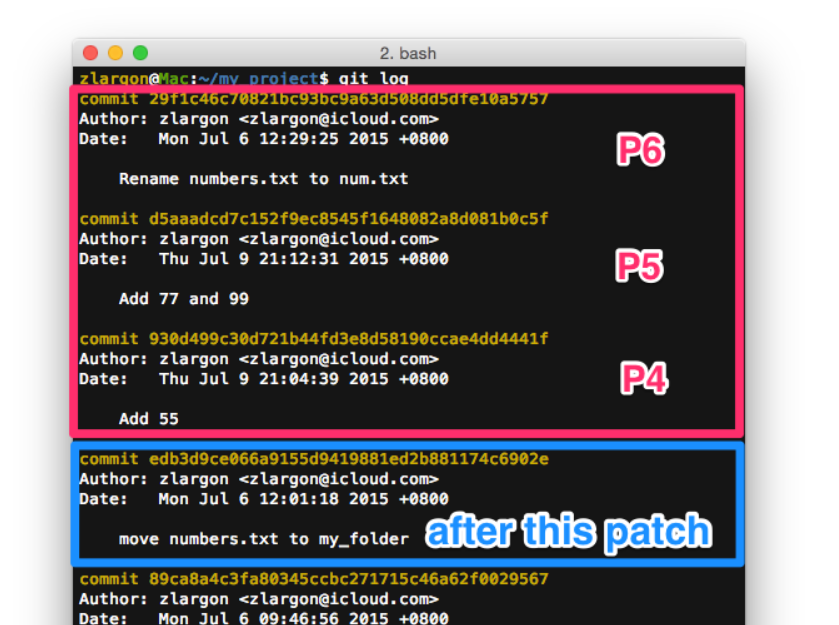
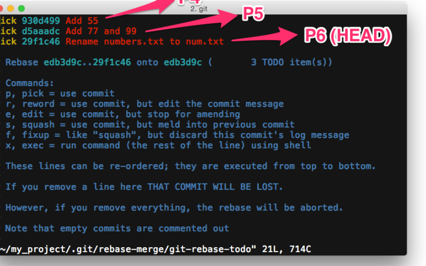
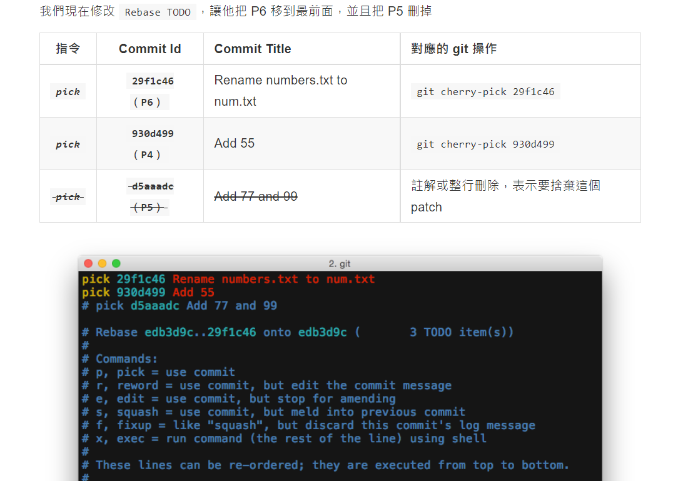
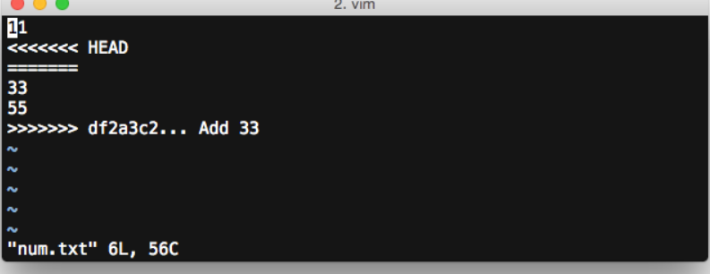

## 知識

```
HEAD^^ OR HEAD~2 表示上兩個 patch
ex: git show HEAD^^ OR git show HEAD~2
```
## 建置
### 初始化

```
	git init
```
### 設定使用者名稱

```
	git config --global user.name
```
### 設定 email

```
	git config --global user.email "example@gmail.com
```
### 設定指令別名

```
	git config --global alias.br branch
```
### 是否忽略檔案大小寫

```
	git config --global  core.ignorecase false
```
### 查詢設定檔

```
	git config --list
```
## 檔案管理
### 查看全部檔案被修改的內容

```
	git diff
```
### 查看特定檔案被修改的內容

```
	git diff <file>
```
### 查看 Changes to be committed 的修改內容

```
	git diff --cached
```
### 全部檔案加入索引

```
	git add -A
```
### 提交 commit (不啟用文字編輯模式)

```
	git commit -m <message>
```
### 查看特定 patch 修改的內容 (不加 id 表示查最後一個)

```
	git show <commit_id>
```
### 刪除檔案

```
	git rm <file>
```
### 加入所有被更動的檔案

```
	git add -u
```
### 搬移檔案(異動追蹤)

```
	git mv <file> <directory>
```
### 重新命名(mv 搬移可視作重新命名 重點差異 "參數是資料夾 or 檔名")

```
	git mv <file> <new_name>
```
### 查看檔案狀態

```
	git status
```
### 還原檔案內容

```
	git checkout -- <file>
```
### 還原檔案狀態

```
	git reset HEAD <file>
```
### 清空 Changes not staged for commit 和 Changes to be committed 區塊

```
	git reset --hard HEAD
```
### 強制加入被忽略的檔案

```
	git add -f <file>
```
## PATCH 管理
### 回到上一個 patch（檔案內容不清空）

```
	git reset HEAD^
```
### 回到上一個 patch，並且強制清除修改的內容

```
	git reset --hard HEAD^
```
### 接 reset 成指定的 patch

```
	git reset --hard <commit_id>
```
### 查看 HEAD 的修改紀錄

```
	git reflog
```
### 查看 reflog 的詳細內容

```
	git log -g
```
### 使 patch 回到上一個階段的 Changes to be committed

```
	git reset --soft HEAD^
```
### 修改提交訊息及內容(push 前注意 commit_Id 該指定會產生新的 commit id)

```
	git commit --amend
```
### git reflog 組合 git reset --soft HEAD^

```
	git reset --soft HEAD@{1}
```
### 挑選 patch 加入 commit

```
	git cherry-pick <commit_id>

	ex:
	git --reset --hard P2 // 回到 P2
	git cherry-pick P4 // 挑選 P4 產生新的 commit id
	// before: P1 -> P2 -> P3 -> P4(HEAD)
	// after: P1 -> P2 -> P4'
```
- 啟動互動模式
- 假設更動範圍 P4 - P6 => after this commit => P3
  
  ```
  	git rebase -i <after this commit>
  ```
  
- 
- 
- 移除 P5
- P3 -> P6 -> P4
  
  ---
### cherry-pick 衝突
- 已解衝突
  
  ```
  	git cherry-pick --continue
  ```
- 取消合併回到 cherry-pick 前狀態
  
  ```
  	git cherry-pick --abort
  ```
  
  ---
- example
- 衝突 num.txt
  
  ```
  You are currently cherry-picking commit df2a3c2.
  (fix conflicts and run "git cherry-pick --continue")
  (use "git cherry-pick --abort" to cancel the cherry-pick operation)
  
  Unmerged paths:
  (use "git add ..." to mark resolution)
  
    both modified:   num.txt
  ```
  
   
  
  ```
  <<<<<<< HEAD (P4)
  
  
  =======
  33
  55
  >>>>>>> Cherry-pick P6
  ```
- P4 沒有修改東西，但是 P6 除了 "33" 之外，還多了 "55"
- 我們在這個 patch 要做的事情只有新增 "33"，我們並不想要提交 "55" 的部分
  
  
- 存檔後 git diff
  
  
- P4 增加 33 / P6 刪除 55
  
  ```
  	git add -u // 加入更新
  	git diff --cached // 查看修改部分，沒問題的話
  	git cherry-pick --continue
  ```
  
  
- 解完衝突後的 message 儲存
  
  ```
  	git log
  ```
  
  
  
  ---
### Rebase 衝突
- 已解衝突
  
  ```
  	git rebase --continue
  ```
- 跳過正在執行的 Rebase TODO 並執行下一個 TODO
  
  ```
  	git rebase --skip
  ```
- 全部取消並回到 rebase 前的狀態
  
  ```
  	git rebase --abort
  ```
  
  
- 當 rebase 指令儲存後
  
  
- 發生衝突
  
- num.txt 保留 55 刪除 33, git add -u 儲存
- 已解決衝突
  
  ```
  	git rebase --continue
  ```
  
  
- Rebase Todo 由上至下一個一個 patch 執行
- 故下一個 patch 發生衝突還會跳出
  
  
- 比照 cherry-pick 解衝突 - >修改衝突檔案
- git add -u
  
  ```
  	git rebase --continue
  ```
  
  ---
- 還原指定 patch
  
  ```
  	git revert <commit id>
  
  	P0    →    ...    →    P4    →    P5    →    P6    →   P4'
                     	   (+BUG)                  (HEAD)     (-BUG)
  ```
  
  ---
### Revert 衝突
- 已解衝突
  
  ```
  	git revert --continue
  ```
- 放棄 revert
  
  ```
  	git revert --abort
  ```
  
  ---
## 分支管理
### 查看所有分支

```
	git branch
```
### 啟動圖形化介面

```
	gitk --all &
```
### 建立新的分支

```
	git branch <name>
```
### 切換分支

```
	git checkout <name>
```
### 建立新的分支並切換過去

```
	git checkout -b <new>
```
### 指定 patch 上建立分支(已存在的話會切換過去)

```
	git branch -f <name> <commit id>
```
### 刪除分支

```
	git branch -D <name>
```
### 移動 HEAD 位置

```
	git checkout <commit id>
```
### 指定 patch 上建立新分支並切換過去

```
	git checkout -b <name> <commit id>
```

---
### Rebase 合併
- 定義分支基準點
  
  ```
  	git rebase <new base>
  ```
  
  
- bugfix 合併 master
  
  ```
  	git checkout bugfix
  	git rebase master
  ```
- bugfix 往上爬找交叉 patch 為 P5
- 之後 bugfix P5 過後的 patch 接 master last commit 後方
  
  
  
  簡寫
  
  ```
  	git rebase <new base> <branch name>
  	ex: git rebase master bugFix
  ```
- 使用 cherry-pick 選入多個 patch
  
  ```
  	git cherry-pick <commit 1> <commit 2>
  ```
- 補救 rebase 回到 rebase 前 HEAD
  
  ```
  	git reset --hard ORIG_HEAD
  ```
  
  ---
  
  ---
### Merge 合併
- 合併分支
  
  ```
  	git merge <branch name>
  ```
- 強制產生 Merge Patch
  
  ```
  	git merge --no-ff <branch name>
  ```
  
  ---
### 合併分支差異


---
## 遠端
### 新增遠端 Repository URL

```
	git remote add <short name> <repo url>
```
### 查看設定好的 remote 資訊

```
	git remote -v
```
### 修改 remote name

```
	git remote rename <short name> <new name>
```
### 刪除遠端

```
	git remote rm <short name>
```
### 上傳分支

```
	git push <remote name> <branch name>
```
### 查看本機端及遠端的分支

```
	git branch -a
```
### 查看遠端分支的內容

```
	git log remotes/github/master --oneline
```
### 上傳分支並追蹤遠端的分支

> 第二次上傳只需要 git push

```
	git push -u <remote name> <branch name>
```
### 設定 upstream 追蹤

```
	git branch -u <remote>/<remote branch>
```
### 取消追蹤遠端分支

```
	git branch --unset-upstream
```
### 下載專案

```
	git clone <repo URL>
```
### 指定分支

```
	git clone <repo URL> -b <branch name>
```
### 下載到指定位置

```
	git clone <repo URL> <folder name/path>
```
### 建立專案副本

```
	git clone <local project>
```
### 更新 "指定" remote 底下的分支

```
	git fetch <remote name>
```
### 更新 "所有" remote 底下的分支

```
	git fetch --all / git remote update
```
### 同步分支(merge)

```
	git pull
```

> `若沒有設定 upstream，就一定要加 <remote name> 跟 <branch name>`
### 同步分支(rebase)

```
	git pull --rebase
```

> `若沒有設定 upstream，就一定要加 <remote name> 跟 <branch name>`
### 強制更新遠端 (協同可能會把別人的 code 蓋掉)

```
	git push -f
```
### 刪除遠端分支

```
	git push <remote name> :<branch name>
```
### 查看更多關於 remote 的資訊

```
	git remote show <remote name>
```
### 刪除 remote 底下所有過時的分支

```
	git remote prune <remote name> / git fetch -p
```
### 同步遠端分支，並且移除過時的遠端分支

```
	git remote update -p / git fetch --all -p
```
## 進階用法

---
### 檔案暫存

```
	$ git checkout -b backup            # 新增 backup 分支，並且切換過去
	$ git add -A
	$ git commit -m "this is backup"    # 提交所有檔案進來
	$ git checkout master               # 回到 master 分支做其他事情
```
- 這時候在 master 做其他工作，完成後用再把 backup 分支挑回來 master 繼續開發
  
  ```
  	$ git cherry-pick backup            # 把 backup 的 patch 挑回 master
  	$ git reset HEAD^                   # 讓 backup 的所儲存的內容，全部回到檔案提交前的狀態
  	$ git branch -D backup              # 刪除 backup 分支
  ```
### git stash 適用修改幅度不大


```
	$ git stash             # 暫存目前被修改的檔案
	$ git stash list        # 列出所有 stash 紀錄
```


```
	Saved working directory and index state WIP on master: 7a165e7 Add 99
	HEAD is now at 7a165e7 Add 99
```

表示這些是在 7a165e7 開發到一半，被 stash 起來的
這裡的 WIP 的意思是 Working In Progress
而 HEAD 也被移到 patch 7a165e7，也就是 master 的最後一個 patch


- 查看所有被我們 stash 的內容
- stash@{0} : WIP on master: 7a165e7 Add 99
  
  ```
  	$ git stash list / $ git show stash@{0}
  ```
- 取得 stash
  
  ```
  	$ git stash pop                 # pop 第一個 stash（stash@{0}）
  	$ git stash pop stash@{n}       # 指定要 pop 出來的 stash 編號
  ```
  
  **使用 git stash pop 之前，要先把 git status 清空**
  
  
  
- 發生衝突的時候 stash 不會被清掉
- 可以使用 git reset --hard HEAD 還原之後，再重做一次 git stash pop
- Update Stream 是你後來提交的部分，Stashed changes 就是 stash 所修改的部分
- 可以先用 git reset HEAD 取消檔案 both modified 的狀態再來解
### 丟棄暫存檔案

```
	git stash drop
```
### 一次清空 stash list 裡面所有的 stash

```
	git stash clear
```

---
### 新增 lightweight tag 別名

```
	git tag <tag name> <commit id>  # 省略 <commit id> 則會 tag 目前的 patch
```
### 新增 annotated tag 正式(release)

```
	git tag -a <tag name> <commit id>
```
### 新增 annotated tag 以及 message

```
	git tag -a <tag name> <commit id> -m <message>
```
### 指定上傳的標籤

```
git push <remote name> <tag name>
```
### 一次上傳所有的標籤

```
	git push <remote name> --tags
```
### 刪除本機端的標籤

```
	it tag -d <tag name>
```
### 刪除遠端的標籤

```
git push <remote name> :<tag name>
```
### 更新 annotated tag 的訊息

```
	git tag -a <tag name> <tag name>^{} -f
```
### 強制更新 remote 的 tag

```
	git push -f <remote name> <tag name>
```

---
## 子模組
### 新增子模組

```
	git submodule add <repo url> <project path>
```
### 下載包含子模組的儲存庫

```
	git clone --recursive <repo URL>
```
- 當使用 git clone 下載包含子模組的儲存庫
- 但是未使用 --recursive 參數補救方式
  
  ```
  	git submodule init
  	git submodule update
  ```
  
  
### 設定忽略 Submodule 內部的改動
- .gitmodules 加入 ignore = dirty 配置
  
  
### 切換 Submodule 版本

cd 到子模組的資料夾路徑下,
手動切換分支再回到上層提交 commit

```
	cd /jquery # 切換子模組路徑
	git checkout master # 子模組第三方假設有 develop => master
	cd .. # 回到專案同層 .git 路徑
	git add -u
	git commit -m 'Update Submodule jquery'
```
### 刪除 Submodule

```
	1. rm -rf <submodule path>  # 或手動移除資料夾
	2. .gitmodules 裡面移除 submodule 設定
	3. 提交 patch
	4. 刪除 .git/config submodule 設定
	5. 刪除 .git/modules/<module name>
```
### 更新子模組最新版本

```
	git submodule foreach --recursive git pull
```
---