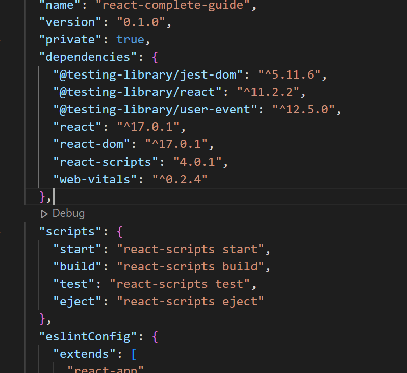

tags:: #course #programming [[frontend developer]] 

>Author(s): [[Maximilian Schwarzmiiller]]
Url: [https://www.udemy.com/course/go-programming-language/#content](https://www.udemy.com/course/react-the-complete-guide-incl-redux/learn/lecture/25599264)
Source Code: [https://github.com/GoesToEleven/golang-web-dev](https://github.com/academind/react-complete-guide-code)

- Section 2 : JavaScript Refrescher
  collapsed:: true
	- Understanding "let" and "const" #javascript/variables
		- ```js
		  const test = 'A';
		  ```
	- Arrow Functions 箭頭函式 #javascript/syntax/function
	- Exports and Imports #javascript/module
	- Understanding Classes #javascript/class
	- Classes, Properties and Methods #javascript/class
	- The Spread & Rest Operator #javascript/syntax
	- Destructuring #javascript/syntax
	- Reference and Primitive Types Refresher #javascript/types
		- 注意陣列與物件是參考記憶體位址
	- Refreshing Array Functions #javascript/syntax/function
		- map 運用
- Section 3 : React Basics & Working With Components
	- What Are Component? And Why Is React All About Them? #react/introduction
		- Rea ct 用於構建使用者介面，以 UI 設計來說通常具有數個相同結構的視覺模型，需要進行分解撰寫可重複使用的代碼，名稱為 Component。
		- 重點整理
			- 單一職責
			- 可重用性
			- 關注點分離
		- >延伸閱讀 💡
		  [用 React 思考 – React (reactjs.org)](https://zh-hant.reactjs.org/docs/thinking-in-react.html)
		  [React 術語表 – React (reactjs.org)](https://zh-hant.reactjs.org/docs/glossary.html#components)
	- React Code Is Written In A "Declarative Way"! #react/introduction
		- 指令式程式設計(Imperative Programming) 告知細節得到結果
		- > 💡 程式演算法過程由自己規劃處理 (程式繁瑣難以除錯)
		- 宣告式程式設計，告知結果細節由封裝好的 React 處理
		- > 💡 程式演算過程由已封裝的函式處理 (程式易讀容易除錯)
	- Creating a new React Project #react/install
	  collapsed:: true
		- CSR
			- [create-react-app-github](https://github.com/facebook/create-react-app)
		- 混合(SSG and SSR)
			- [Nextjs](https://nextjs.org/)
		- 靜態專案
			- [Gatsby](https://www.gatsbyjs.com/)
			- [docusaurus](https://docusaurus.io/)
				- [與其他工具比較介紹](https://docusaurus.io/zh-CN/docs#comparison-with-other-tools)
		- CDN 方式載入 HTML
			- [官方介紹文件](https://reactjs.org/docs/add-react-to-a-website.html)
		- 線上編譯 Coding 工具
		  collapsed:: true
			- [CodePen](https://codepen.io/pen?&editable=true&editors=0010)
			- [CodeSandbox](https://codesandbox.io/s/new)
			- [Glitch](https://glitch.com/edit/#!/remix/starter-react-template)
			- [Stackblitz](https://stackblitz.com/edit/react-jpp86w)
		- reference
			- https://zh-hant.reactjs.org/docs/create-a-new-react-app.html
	- Analyzing a Standard React Project #react/install
	  collapsed:: true
		- 透過 CLI 建立專案
		- ```
		   npx create-react-app my-app
		  ```
		- 
		- react 定義 component 所需要的功能
		- react-dom 定義 DOM 與 server 渲染
		- react-scripts 定義 scripts & configuration 配置
	- Introducing JSX #react/ui/jsx
	  collapsed:: true
		- JavaScript XML 使用類似 XML/HTML 的語法， 它支援 ECMAScript，讓 XML/HTML 文本可以與 JavaScript / React 代碼共存，簡稱 JSX
		- ```js
		  const element = <h1>Hello World</h1>
		  ```
		- 宣告變數的標籤語法就是 JSX，回傳 React Elemnet
		- ```js
		  const name = 'Josh Perez';
		  const element = <h1>Hello, {name}</h1>;
		  ```
		- >小知識 💡 
		  通常 element 不會被直接使用，而是在 component 中被返回
		- 元素內可以崁入 Expression
		- ```js
		  // 字串
		  const element = <a href="https://www.reactjs.org"> link </a>;
		  // 或者是 Expression
		  const element = </img>;
		  ```
		- HTML Tag 使用屬性純字串或變數
		- ```
		  const element = ;
		  const button = <button onClick={(e)=>{console.log(e)}} />;
		  ```
		- >小知識 💡
		  屬性名稱採用小駝峰，部分屬性會遇到 JavaScript 保留字問題有所異動 (class => className) (for => htmlFor)
		  https://zh-hant.reactjs.org/docs/dom-elements.html
		- 與 XML 標籤相似，當標籤是空白允許使用 /> 關閉標籤
		- ```js
		  const element = (
		    <div>
		      <h1>Hello!</h1>
		      <h2>Good to see you here.</h2>
		    </div>
		  );
		  ```
		- JSX 標籤多個 children
		- ```js
		  const element = <h1 className="greeting">Hello, World!</h1>
		  const element2 = React.createElement('h1',{className: 'greeting'},'Hello, World!');
		  ```
		- JSX 透過 Babel 編譯後會是呼叫 React.createElement() 去建立 XML 標籤
		- ```js
		  function App() {
		    return (
		      <div>
		        <h2>Let's get started!</h2>
		        <ExpenseItem></ExpenseItem>
		      </div>
		    );
		  }
		  
		  function App2() {
		    return */*#__PURE__*/*Object(react_jsx_dev_runtime__WEBPACK_IMPORTED_MODULE_1__["jsxDEV"])("div", {
		      children: [*/*#__PURE__*/*Object(react_jsx_dev_runtime__WEBPACK_IMPORTED_MODULE_1__["jsxDEV"])("h2", {
		        children: "Let's get started!"
		      }, void 0, false, {
		        fileName: _jsxFileName,
		        lineNumber: 6,
		        columnNumber: 7
		      }, this), */*#__PURE__*/*Object(react_jsx_dev_runtime__WEBPACK_IMPORTED_MODULE_1__["jsxDEV"])(_components_ExpenseItem__WEBPACK_IMPORTED_MODULE_0__["default"], {}, void 0, false, {
		        fileName: _jsxFileName,
		        lineNumber: 7,
		        columnNumber: 7
		      }, this)]
		    }, void 0, true, {
		      fileName: _jsxFileName,
		      lineNumber: 5,
		      columnNumber: 5
		    }, this);
		  }
		  ```
		- 查看 build 後的程式碼
		- 經編譯後是呼叫一個 function 與 React.createElement 傳的參數一致，React.createElement() 會檢查寫法是否有 BUG
		- ```js
		  // 注意：這是簡化過的結構 (模擬 DOM 樹狀結構)
		    const element = {
		      type: 'h1',
		      props: {
		        className: 'greeting',
		        children: 'Hello, world!'
		      }
		    };
		  ```
		- 執行後會產生物件
	- How React Works #react/introduction
		- 我們用比較的方式說明 React Work 原理
		- ```js
		  // 1. Vanilla JS (指令式)
		  // 選擇實體 DOM (ID = root)
		  var root = document.getElementById("root");
		  // 產生 Button DOM
		  var button = document.createElement("button")
		  // 賦予內容
		  button.textContent = "按鈕";
		  // 掛載 root DOM 的子節點
		  root.append(button)
		  
		  // 2. React JS (宣告式)
		  // 引入函式
		  import {createRoot} from "react-dom/client";
		  // 產生 React element (通常是用 React Component render 返回 React element)
		  var button = <button>按鈕</button>
		  // 在實體 DOM 節點上建立 React 根節點
		  var root = createRoot(document.getElementById("root"))
		  // 渲染
		  root.render(button)
		  ```
		- React 負責生成、運行實際 DOM 指令更新畫面上的內容
	- Building a First Custom Component #react/ui/component
		- React Component 返回一個被 render 在頁面的 React element
		  id:: 634b89ff-6ccb-41db-ab9a-145620ebc869
		- ```js
		  // Function
		  function Welcome() {
		    return <h1>Hello</h1>;
		  }
		  
		  // ES6 Class
		  class Welcome extends React.Component {
		    render() {
		      return <h1>Hello, {this.props.name}</h1>;
		    }
		  }
		  ```
		- 命名規範
		- ```
		  /components/ExpenseItem.jsx
		  ```
		- Component render React element 所以可以被其他 Component 引用
		- ```jsx
		  <Todo></Todo>
		  ```
			- 小寫開頭是原生 XML
			- 大寫開頭是自定義的 React Component
	- Writing More Complex JSX Code #react/ui/jsx
		- JSX 語法透過 Babel 編譯後會等於 React.createElement() 語法
		- ```js
		    React.createElement(
		      type,
		      [props],
		      [...children]
		    )
		  ```
		- type 參數可接受類型
			- HTML tag 字串 (例如: "div", "span")
			- React Component
			- React Fragment type #react/ui/fragments
		- ```js
		  // 正確 Type 參數 (使用 Fragment)
		  function ExpenseItem() {
		    return <>
		      <div>March 28th 2021</div>
		      <div>
		        <h2>Car Insurance</h2>
		        <div>$294.67</div>
		      </div>
		    </>;
		  }
		  
		  // 錯誤 Type 參數
		  function ExpenseItem() {
		    return (
		      <div>March 28th 2021</div>
		      <div>
		        <h2>Car Insurance</h2>
		        <div>$294.67</div>
		      </div>
		    );
		  }
		  ```
		-
	- Adding Basic CSS Styling #react/ui/css
		- 引入 css 檔案 (全域)
		- ```jsx
		  import './ExpenseItem.css';
		  function ExpenseItem() {
		    return (
		      <div className="expense-item">
		        <div>March 28th 2021</div>
		        <div className="expense-item__description">
		          <h2>Car Insurance</h2>
		          <div className="expense-item__price">$294.67</div>
		        </div>
		      </div>
		    );
		  }
		  ```
	- Passing Data via "props" #react/ui/props
		- 之前說明 ((634b89ff-6ccb-41db-ab9a-145620ebc869))
		- 則 props 是 React Component 的數據輸入，它可以是任何型別就像 Function 參數
		- 只接受讀取不可更改 (單向數據流)
		- ```jsx
		  
		  function Welcome(props) {
		    props.name = "hellow" // 不行
		    return <h1>Hello, {props.name}</h1>;
		  }
		  
		  ```
		- > 小知識 💡
		  透過 funciton 把資料往上傳遞
		- ```jsx
		  function Test(props) {
		    const name = "Hello"
		    const clickHandler = ()=>{
		  	props.onClick(name)
		    }
		    return <div onClick={clickHandler}> Hello</div>;
		  }
		  function App() {
		    const clickHandler = (value)=>{
		      console.log(value)
		    }
		    return <Test onClick={clickHandler}/> ;
		  }
		  
		  ```
		-
	- The Concept of "Composition" ("children props") #react/ui/props #react/ui/component
		- props 有特殊的屬性 children 是 Component 用來崁入標記之間的內容
			- ```jsx
			  function Welcome(props) {
			    return <p>{props.children}</p>;
			  }
			  
			  <Welcome>Hello world!</Welcome>
			  ```
		- 構建應用程式裡我們會有多個 Component 會進行 Composition (組成)
			- 大型 Component 抽離變成多個小型 Component，由多個小型組成大型 Component
			- 小型 Component ( Dialog ) 透過 props 變成特別某一功能的 Component ( WelcomeDialog )
		- > 延伸閱讀 💡
		  React Component 之間使用非 UI 的功能，建議抽離成獨立 JavaScript 模組透過 import 使用。不需要在 Component 使用繼承過於複雜化它。
	- Working with "State" #react/state
		- 設計 Component 時會有某些數據是需要被儲存，當使用者進行操作導致 "數據要被更新"。會==安排更新排程==，這種儲存稱為狀態且屬於 Component 私有的。
		- > 💡 ==安排更新排程==
		  這裡意思是 State 更新是異步的，如果內容不在畫面上將會延遲與之相關的任何邏輯，如果數據更新速度快於畫面幀速率的話，會合併並批量更新。優先考慮來自使用者互動的事件，而不是不太重要的幕後事件 ( 例如渲染剛剛從網路載入的新內容) 以避免丟幀。
		- ```js
		  const [state, setState] = useState(initialState);
		  ```
		- ```js
		  // 注意使用 setState 因為是異步事件 如果要依賴當前 state 
		  // 請使用 function 帶參數方式更新
		  
		  setState(state=>state+1)
		  ```
		- > 延伸閱讀 💡
		  [使用 State Hook – React (reactjs.org)](https://zh-hant.reactjs.org/docs/hooks-state.html)
	-