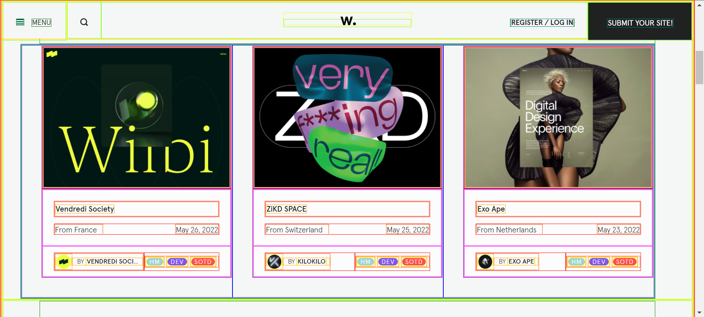

- ## React 思考
	- 前提摘要我們得知 React 使用宣告式設計 view ，這將改變你對設計應用程式的看法
	- 
	- 框線表示 HTML TAG ，具體表達出層級結構。以卡片為例設計 view 可變成 Card Header, Card Body Card Footer，也可以稱為 Product，其分解層級結構的過程中，會以單一職責為準則不混雜處理多個畫面結構與邏輯。
	  
	  >延伸知識 💡
	  建議閱讀官方介紹 - [Thinking in React (reactjs.org)](https://beta.reactjs.org/learn/thinking-in-react#step-3-find-the-minimal-but-complete-representation-of-ui-state)